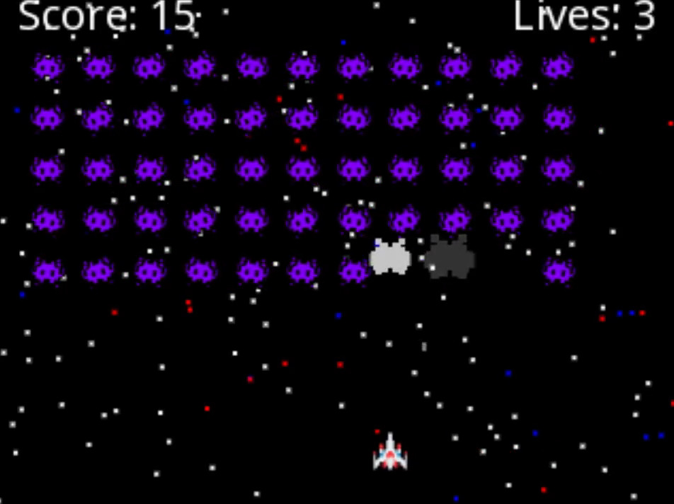

# Space Invaders Clone

This is a Space Invaders clone built using HTML5 Canvas and JavaScript, powered by Vite for development and bundling. The entire project was written in just 2 hours step-by-step from a blank project using ["GitHub Copilot Edits"](https://code.visualstudio.com/docs/copilot/chat/copilot-edits). You can watch the YouTube stream of its creation [here](https://youtu.be/hFR1IpF5_Lc).

## Project Structure

```
codegen-space-invaders
├── src
│   ├── main.js        # Main game logic
│   ├── index.html     # Main HTML file
│   └── assets         # Game assets (images)
│       ├── enemy.png
│       └── spaceship.png
├── package.json       # npm configuration file
├── vite.config.js     # Vite configuration file
└── README.md          # Project documentation
```

## Features

- **Player spaceship**: Move left and right, shoot projectiles.
- **Enemies**: Rows of enemies that move and shoot back.
- **Explosions**: Animated explosions using WebGL shaders.
- **Game states**: Title screen, gameplay, and game over screen.
- **Responsive scaling**: Canvas resizes dynamically to fit the screen.
- **Score and lives**: Track player progress and remaining lives.

## Getting Started

To get started with this project, follow these steps:

1. **Clone the repository:**
   ```
   git clone <repository-url>
   cd codegen-space-invaders
   ```

2. **Install dependencies:**
   ```
   npm install
   ```

3. **Run the development server:**
   ```
   npm run dev
   ```

4. **Open your browser and navigate to:**
   ```
   http://localhost:3000
   ```

## Controls

- **Arrow keys**: Move the player spaceship left and right.
- **Spacebar**: Shoot projectiles.
- **Escape**: Pause or resume the game.

## Building for Production

To build the project for production, run:
```
npm run build
```

This will create a `dist` folder with the production-ready files.

## License

This project is licensed under the MIT License.